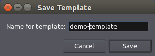

If you often go through the motions of setting up the same information
in each new Session you create, such as the number of input and output
Channels, the number and names of Tracks or Busses, or the Routing, then
you may wish to create a Template of that information instead.

With a **Template**, you can save the state of a currently open Session
*without* all the Region information files. Templates are useful if, for
example, you're doing extensive Routing on Tracks and Buses and want to
save the Editor Window's state for use in other Sessions. An example
might be a Template to record Tracks of drums, bass, guitar and vocals,
each with their own input on the soundcard, which you might use as a
basis for each Session you created in that situation. 

## Save a Template

You can save a new Template from the Main Menu: *Session > Save Template*. You are asked to give the new Template a name:

## Load a Template

When creating a new Session, you get can now load up a previously saved Template:

In summary: Session Templates are a way to store the setup of a session for future use. They do not store any audio data but can store:

* The number of tracks and busses, along with their names.
* The plugins present on each track or bus (if any).
* All I/O connections.

## Conclusion

Congratulations, you have reached the end of this introduction to Ardour! We hope that this tutorial has been useful for you to learn the key functions of Ardour.

In the following section, the **Appendices**, we have included some
extra information we thought would be useful to new users of Ardour,
including how to get [**Further Help**](../further-help), a [**Glossary**](../glossary) of technical terms
used in this manual, some [**Links**](../links) to further information about Ardour
on the Internet and, last but not least, the [**Credits**](../credits) of those
involved in creating this Free/Libre Open Source Software (FLOSS) Manual.

Thanks for reading, and if you have some knowledge about Ardour that is
not included here, please feel free to propose changes. Also, this manual itself is fully open source and lives at [https://github.com/brunoruviaro/ardour3-floss-tutorial](https://github.com/brunoruviaro/ardour3-floss-tutorial). You can even fork it and create your own customized version of it!

**Appendices:**
[FURTHER HELP](../further-help)   ||
[GLOSSARY](../glossary)   ||
[LINKS](../links)   ||
[CREDITS](../credits)
