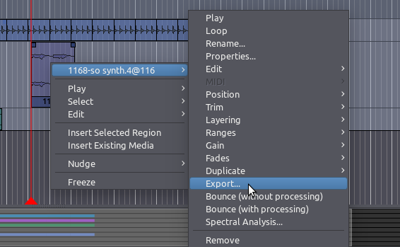
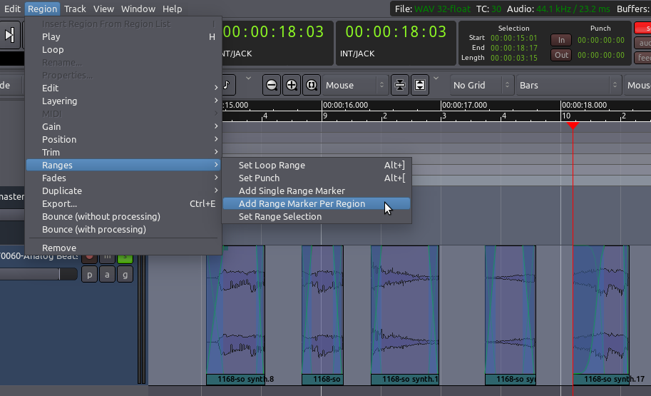
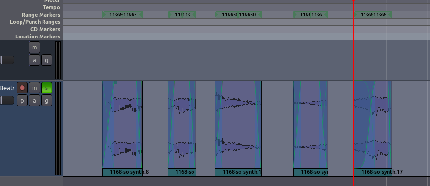
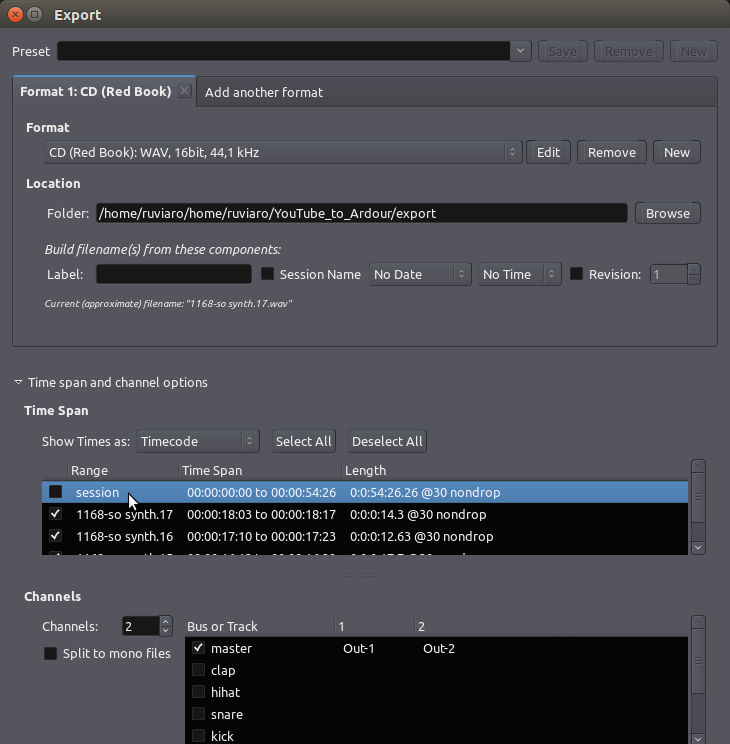

You may wish to Export only a Region of your Session, perhaps to use as a sample in another application, or to Edit
it in a different editor program. This chapter shows you how.

## Exporting a Region

To Export a Region, select it (so it becomes blue), and then right-click into the sub-menu
**Export**, or use the top menu: *Region > Export*.

This will open up the same Export dialog box explained in the [Exporting a Session](../exporting-a-session) chapter.
Choose your options, and click "Export". Only the selected Region will be exported.

Please note that when exporting a Region, not all parameters and edits
are exported. **Trimmed**, **split**, **stretched** and **reversed**
regions can be exported, but edits such as and **Panning**, and **Automation** are *not* exported.
Also, the volume of the audio Track itself or the Master Bus will not affect the exported
file. To export these edits, please see the chapters on **Exporting a Range** and **Exporting a Session**.

## Exporting Several Regions At Once

If you are building a collection of samples to use later in another software, and your samples are basically trimmed and edited Regions, at the end of the process you will need to export all of them. If the number is large, exporting them manually can be tedious. Here's one way of exporting several Regions at once.

* In Object Mode (shortcut "*O*"), select all the Regions you want to Export. They do not need to be on the same Track.

* Go to menu *Region > Ranges* and choose *Add Range Marker Per Region*.

* Ardour has now just created Range Markers that fit exactly the beginning and ending of your selected Regions (see the green rectangles in the Range Markers timeline):

* Go to menu *Session > Export* and choose *Export to Audio File(s)*.

* In the Export dialog box, click on the little triangle next to "*Time span and channel options*". You will see all the newly created Ranges listed there. There is also a default Range that stands for the entire Session. 

* Under "Time Span", click "*Select All*", and de-select the very first Range (the "session" Range). The reason is because we want to export the shorter Ranges, not the whole Session.

* Close the "*Time span and channel options*" by clicking on the little triangle again.

* Click "*Export*".

You Regions have now been exported to single audio files.

## Continuing

Finally, the next chapter will show discuss **Exporting Ranges** rather
than just an individual Region. The last trick (exporting multiple Regions at once) in fact already involved using Ranges, as you may have guessed.

Next: [EXPORTING A RANGE](../exporting-a-range)
