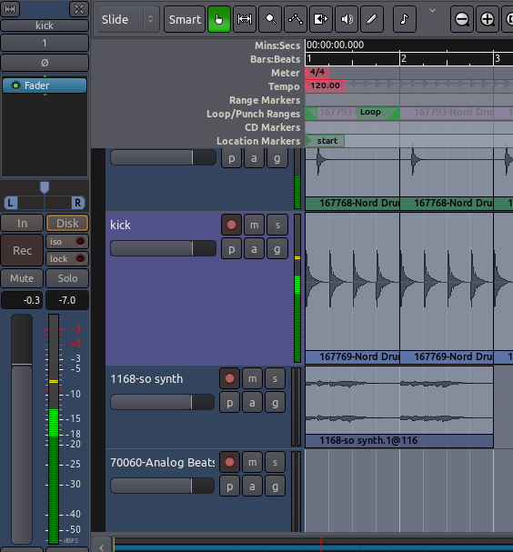
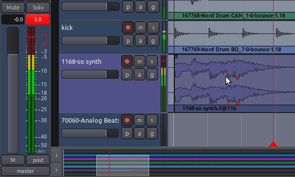

**Levels** are the volumes of each Track relative to the others.

If you can't hear a bass line above the other instruments, the obvious choice
would be to raise the bass line volume. Levels can be adjusted using the
Fader in the Mixer Strip or in each Track, just below the Track name.
The first step in Mixing is to listen to everything that has been
recorded and adjust the levels of all Tracks so you can hear everything
clearly, but in a manner that is appropriate for the song. For example,
the vocal track is normally louder than the rhythm guitar because the
voice is the focal point of the song.

## Using the Fader

The Fader is the primary control of Levels for each Track. The exact
value of the Track's Levels are displayed in the small rectangular field
above the Fader. You can change the Levels by either dragging the slider
or typing in a new number directly into the rectangle with the number.
By default the Fader is set to −0.0 dB, meaning that the Levels of the
Track are not changed. In the screenshot below, the
Fader for the track named "*kick*" is set to -0.3, and the Peak Meter
indicates that the highest peak so far was -7.0. 

 

## Avoiding Clipping

One other important task in Mixing is to avoid **Clipping**. The Peak
Value on the Mixer Strip turns red when the signal has peaked above
0.0dB. You can use this tool to monitor the highest Levels of your Track
while Mixing. 

In the screenshot below, the synth track has just clipped to +3.0. You
can also see little red edges on the waveform itself, indicating the
exact locations where the recorded sound clipped. 

Click on the red number in the Peak Meter to reset it.

> TIP: for the sake of the exercise, try to record your voice so that it clips. Hear how the playback is distorted.

You should make sure that anything that you send to your sound card or
that you will eventually Export as a sound file (such as for CD
mastering) **never** goes above 0.0dB to avoid actual Clipping.

If the clipping occurs in a very percussive sound and it is almost unnoticeable, you may be able to hide it by
decreasing the gain (for example, Normalize the region to 0.0, or a
lower number like -1.0). However, often the clipping results in audible
distortion of the recorded sound. The best solution in this case is to
just record again with lower levels.

## Continuing

When you are finished with this chapter of the tutorial, you should have
a collection of Tracks whose Levels are well adjusted to each other and
do not Clip when added together in the Master Bus. Once this is
accomplished, we can proceed to learn about **Panning** in the next
chapter, so that our Mix takes on a strong feeling of Stereo space.

Next: [PANNING](../panning)
