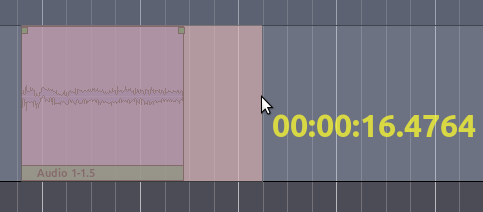
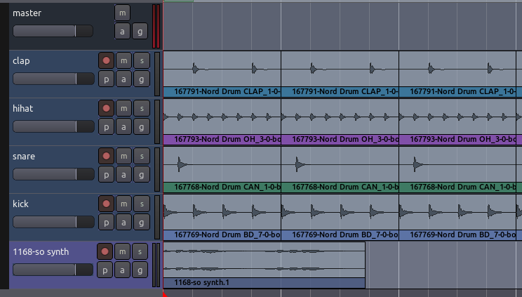
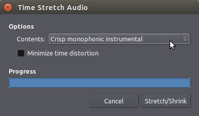
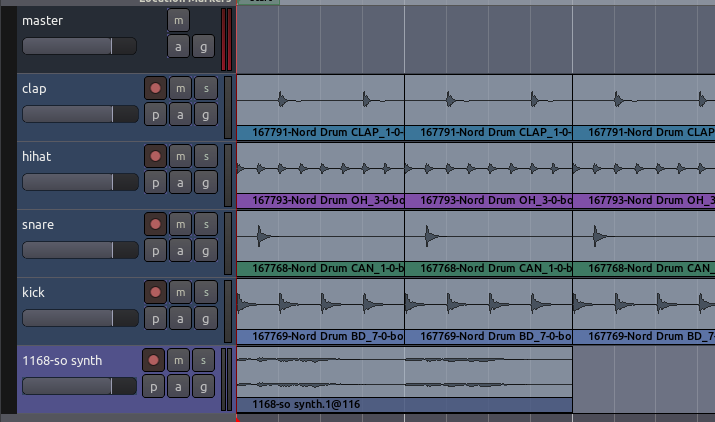

Regions can be stretched or shrunk in length without changing their
Pitch by using the **Stretch/Shrink Regions** tool (shortcut "*T*", for
"Time stretch").

A small adjustment to the length of a Region may not
cause noticeable sound **Artifacts**. However, the more extreme the
change in length, the more obvious the effect of processing on the
sound.

 

To use **Stretch/Shrink Regions**, place your cursor on top of the
region, and then Click-drag left or right. While dragging, you will see
a highlighted area, which represents the new duration to which the
Region will be shrunk or stretched when you release the mouse at the
current position.

## Time-Stretching a Region to Fit the Loop

In this tutorial, we've added another sound sample—this time, a
synthesizer line—from [freesound.org](http://www.freesound.org) to the
rhythmic passage we composed in the **Creating Looped Sections** chapter
(search for tag "1168" in the **Search Freesound** tab of Ardour if
you'd like to get the same sample. Import it as a new track).

After importing this synth line, we see that the length of our new
Region doesn't match the existing rhythm we've already created. It's too
long to be one bar and too short to be two bars.

 

We can correct this by using the Stretch/Shrink tool. Select the Region
you wish to stretch, and drag the new length to the end of the second
Bar, again assisted by the Grid settings.

When you release the mouse button, the **Time Stretch Audio** dialog will
appear. You can experiment with different settings for the Time Stretch
operation. Each will affect the sound in different ways. It's a good
idea to experiment with a few different stretch settings to find out
which gives the result you're most happy with.

 

Click **Stretch/Shrink** in the Time Stretch dialog to start the
operation.

When the Time Stretch operation is complete, the region of the
synthesizer line will now be exactly two Bars long, and should fit in
with the rhythm we already created with the drum samples.

 

## Continuing

This was the last chapter of the **Editing Regions** section. Next we go into Mixing.

Next: [MIXING SESSIONS](../the-mixer-strip)
