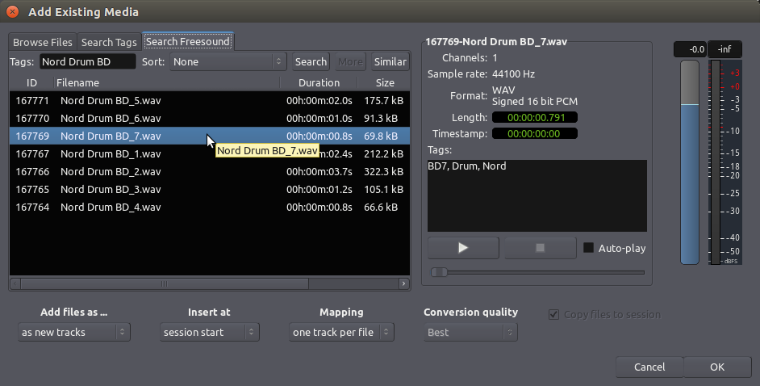
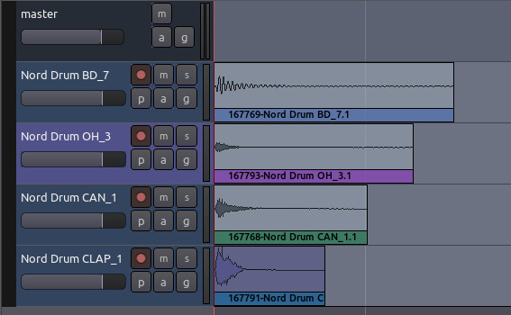
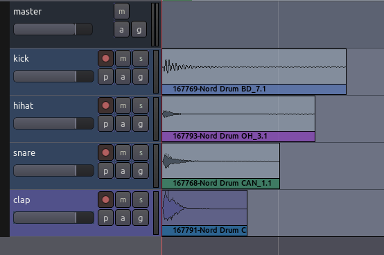
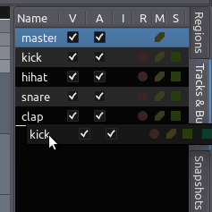
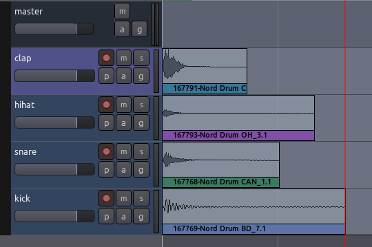

In the following chapters we will use Ardour to create a short rhythmic
passage using several drumkit samples.

We will continue working on this
passage in later tutorials, such as **Working with Regions** and
**Creating Looped Sections**. We assume that you have read the chapters
in the **Getting Started** section already, and are familiar with
**Importing Audio**, **Tracks**, and the **Timeline**.

Importing Samples
-----------------

The first step is to add some sounds, which is discussed at length in
the **Importing Audio** chapter. Here, we are using the **Add existing
media** dialog ("*Ctrl*" + "*I*") to import some drumkit samples as
regions. The samples used in this tutorial were obtained from a sample
pack from the [freesound.org](http://www.freesound.org/) website. You
can download samples from freesound.org by going to the website itself,
but Ardour also has a handy **Search Freesound** feature built into the import
window. From there, you can search and download Freesound.org samples
directly.

 

In the screenshot above, we searched for "*Nord Drum BD*" using the
**Search Freesound** feature of Ardour. Note that we specify that the
audio file should be added "*as new tracks*" and inserted "*at session
start*" (menu options at the lower left). The drumkit sample will appear
as new individual track in the Editor Window, each with the name of the
audio file used. 

After importing a few more sounds (one snare, one hi-hat, and one clap),
our session looks like this (track names come from the original sample
name from freesound.org):

 

Organizing the Tracks
---------------------

Now we rename the tracks so we can quickly see the location of each
instrument (double-click on the track name to edit it).

 

You may also wish to rearrange the order of the tracks from top to
bottom in the editor window. Do that by clicking the **Tracks &
Busses** tab at the far right of the Editor Window and drag-and-dropping
the tracks in the order you want.

 

>Tip: you can also use the V check boxes in this tab to view or hide
Tracks in the Main Canvas.

Here we have ordered the drumkit so that the kick drum is on the bottom,
the snare and high hat are in the middle, and the clap is on top.  

 

Continuing
----------

In the next step we will learn about **Setting Up the Meter** to
organize these samples into a rhythm.

Next: [SETTING UP THE METER](../setting-up-the-meter)
