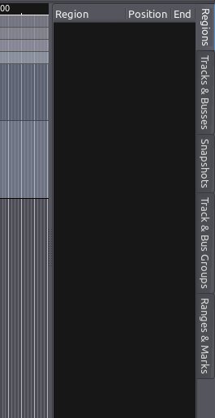
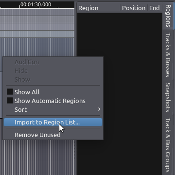
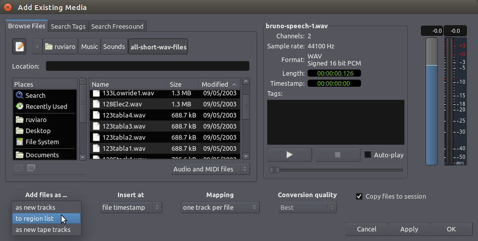
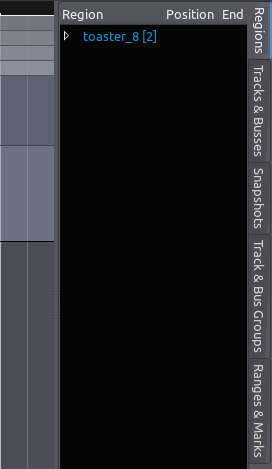
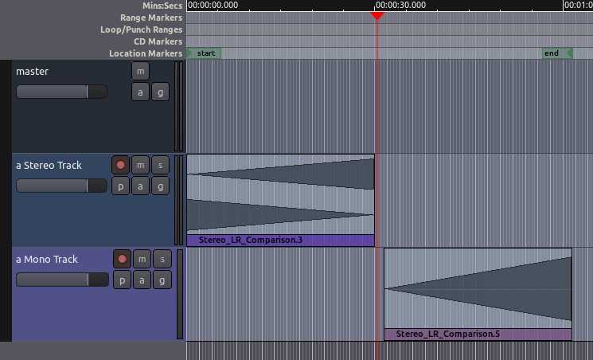
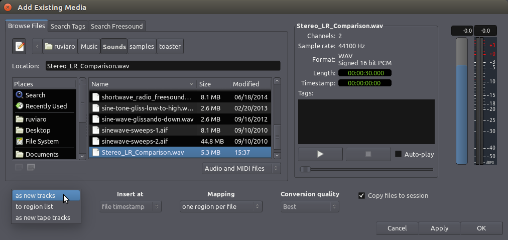
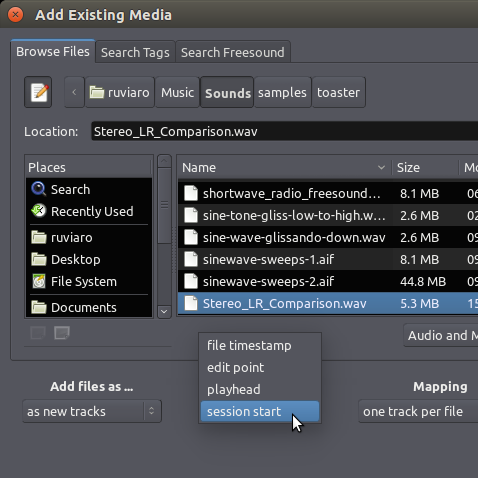
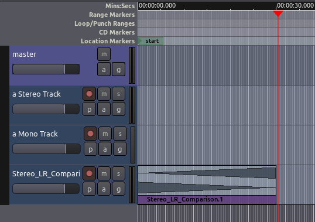

Sections of audio are known as **Regions** in Ardour. A Region can be an
entire sound file or a portion of it. Here you will learn how to import
audio files from the hard drive of your computer so they can be used in
your Ardour session.

To import an audio file, first Right-Click on the **Region List**,
located at the far right of the editor window. If you don't see it, make
sure "*Show Editor List*" is checked under the "*View*" menu. Once you
see the Editor List, please note there are other tabs which change the
function of this area. Before you Right-Click, make sure the **Regions**
tab is selected.

 

Once you have Right-Clicked, a menu will appear with the option to
*Import to Region List*. Click this option.

 

You will now see the *Add existing media* dialog (note: a shortcut to
get to this window is "*Ctrl*" + "*I*"). On the left side of this dialog
you will see a file browser which allows you to search your hard drive
for appropriate sound files to add (preferably, start with a common file
format, such as WAV or AIFF). At the lower left corner there is a menu
which indicates how these files will be added. "*Add files as new
tracks*" will import audio files and place them on a newly created
track. "*Add files to region list*" will simply import audio files into
the Region List, without creating any new tracks. Choose this option
now, as we don't want Ardour to create any tracks at this point.

 

> TIP: if you do not have any suitable audio files on your hard drive to
follow these steps, click on the "Search Freesound" tab (or visit
[freesound.org](http://www.freesound.org/)), from where you can find a
large collection of Public Domain and Creative Commons–licensed samples in a variety of
Sample Rates and Formats.

On the right side of the **Add existing media** dialog you will see a
section allowing you to inspect the properties of the file you selected.
Here you will see the name, number of channels, sample rate, format and
length of the sound file, along with any tags you have chosen to add to
the file.

The **Play** button allows you to preview the file, using the Audition
bus. Finally, this dialog gives you the option of copying the file(s)
into the folder of the current session (**Copy Files to Session**). This
is safer, but it uses more disk space. If you leave this option
unchecked, Ardour will use the sound file from its current location on
the hard drive. In this case, if the file is moved to a new location on
the hard drive, you may run into trouble, because Ardour won't be able
to find it the next time you open this session. **It is highly recommend
that you leave this box checked ("Copy files to session")**. 

Click **OK** to proceed. The file(s) you have selected will appear
listed in your Region List.

> TIP: if the sample rate of the file you have chosen does not match the
sample rate of the current session, Ardour colours the mismatched sample
rate in red. If you try to import the file, Ardour will also warn you of
the mismatched rate and ask you to confirm if you want to embed it
anyway. If you do choose to embed the file in question, it will not play
back at the sample rate it was recorded with, but rather at the sample
rate of the current Ardour session. This will cause the sound to play at
the wrong speed and pitch.

Once you have successfully embedded your audio file in the Region List,
you will see it on the screen. In the screenshot below, "*toaster\_8*"
is the name of the audio file, and the number \[2\] right after it
indicates it is a stereo file. 

 

By dragging and dropping the Region onto the Main Canvas, you can insert
it in an existing track.

> TIP: if you click in the middle of the
word when the region name is highlighted in blue, Ardour thinks you are trying to rename the Region (the name will
become editable). In order to click and drag a highlighted region from the list, you need to point and
click right before or after the name. 

Release the mouse-click to complete the drag-and-drop operation. The
Region will be inserted at the exact time point where you dropped it.

Important: always make sure you are placing Stereo Regions on Stereo
Tracks. If you drag a Stereo file onto a Mono Audio Track, only the left
channel will used. In the screenshot below, a stereo file with very
distinct left and right channels was dragged onto a Stereo Track and a
Mono Track. Notice that in the Mono Track only the left channel is
displayed (and played back).  

 

### Importing Audio Directly to a Track

As mentioned earlier, the **Add existing media** dialogue also allows you
to import audio files directly onto tracks.

Choose **Add files: as new tracks** in order to automatically create
a new track and add the selected file to it. The track will be named
after the sound file name. 

 

If you have previously selected on or more tracks, the menu will display the
additional option **Add files: to selected tracks** in order to add a sound
file into the already existing selected track. 

#### Choose Insert Point

When using either one of the options above ("add as new track" or "add to selected tracks"),
you should also specify where in the track you want the
new Region to be placed. In the screenshot below, we are choosing
"*session start*".

 

The Region appears in a new track in the session. The new track
automatically receives the name of the imported sound file.

 

The sound file will also appear in the Region List so that it can be
inserted into other tracks as well (drag and drop).

### Remove Regions from Tracks

To remove a region from a track, one can select it with the mouse and
use the *Cut* function from the menu, the *Control* (or *Apple*) key and
the *X* key, the *Delete* key or the key combination of *fn* and
*Backspace* (which is used, for example, on a laptop keyboard that does
not have a proper *Delete* key).

> TIP: **Save your work often!** The shortcut "Control" + "S" is your friend. Use it a lot, all the time.

Continuing
----------

At this point, you may wish to add some new material to your Session by
**Recording Audio** in the following chapter, or you may want to skip
directly ahead to the **Editing Sessions** section to learn how to
arrange the Regions you have Imported into a composition.

Next: [RECORDING AUDIO](../recording-audio) or [ARRANGING TRACKS](../arranging-tracks)
