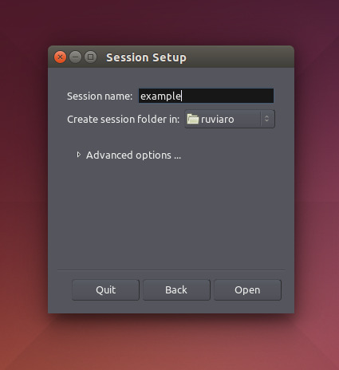
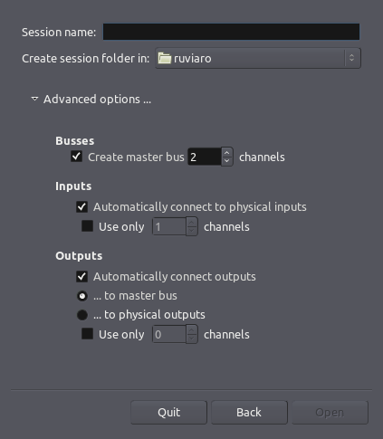

Ardour groups your work in **Sessions**. A Session is a group of
**Tracks** which eventually may be mixed down into a single Mono, Stereo
or multi-channel sound file. Sessions are essentially projects; all your
data is saved in a single Session folder.

When you start Ardour, you are asked if you want to start a new Session
or open an existing one. When creating a new Session you must choose a
name for it.

> TIP: Avoid using any characters other than letters and numbers when naming your session. Avoid white spaces, accented letters, !@#$%*()+, periods, commas, etc. Use dashes or underscores if you like. For example, instead of "My Great Session!", prefer "My_Great_Session", or "MyGreatSession", or "my-great-session". Instead of "Açaí", write "Acai" (without accented letters), etc. Once you have created your Ardour session, do **not** manually rename any folders or files that belong to the Session.

You also need to tell Ardour where you would like the
Session folder to be stored.

When you are ready, click '*Open*'. Ardour
will create the new Session and then open it.

Advanced Options
----------------

If you click the small triangle to access the *Advanced Options*, you
will have finer control over the following options:

-   Whether or not to create a **Master Bus** (i.e. the final audio
    output of the session), and how many channels it will have.
-   Whether or not to automatically connect inputs from the computer's
    audio interface (the sound card) to Tracks in the session, and how
    many channels to use.
-   Whether or not to automatically connect outputs to either Master Bus
    or outputs of the audio interface, and how many channels to use. 

 

Note you cannot directly choose the **Sample Rate** (the number of audio
samples recorded in one second) of the new Session. This will be the
Sample Rate at which JACK is currently running. Ardour only allows you
to open a Session created at the current JACK Sample Rate. For example,
a Session created when JACK was running at 96 kHz will not open if JACK
is currently running at 48 kHz.

To create an Ardour session after Ardour has already started, select
**Session** > **New** in the menu.

TIP:

Continuing
----------

Once you've started a Session, you will most likely want to learn about
setting up the timeline to match the kind of musical meter or other
timeframe which you will use. Please continue to the next chapter. 

Next: [SETTING UP THE TIMELINE](../setting-up-the-timeline)
