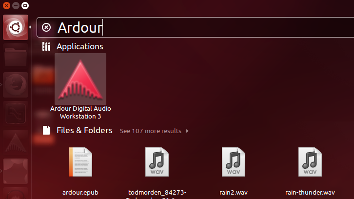

Now that JACK and Ardour are installed, and JACK has been successfully
started, you can start up Ardour.

Click on the Ardour icon to start the program.

On Ubuntu, you can find and launch software using the Dash. Tap the
*"Super"* key (or *"Super" + "A"* to go directly to the Dash App Lens)
and type Ardour. You can then click on the Ardour icon, or simply hit
*Enter* when Ardour is the first search result:

Click on **Ardour Digital Audio Workstation 3** and the program will
start.

Once you have started Ardour, the **Session Control** window shows up.
You can click on **New Session** to create a brand new session, or you
can open an existing session using the **Recent Sessions** and **Other
Sessions** options. For now let's create a fresh session, so click on
**New Session**. The window should now look like the screenshot below.

Name your new project and click **Open** .

> TIP: Avoid using any characters other than letters and numbers when naming your session. Avoid white spaces, accented letters, !@#$%*()+, periods, commas, etc. Use dashes or underscores if you like. For example, instead of "My Great Session!", prefer "My_Great_Session", or "MyGreatSession", or "my-great-session". Instead of "Açaí", write "Acai" (without accented letters), etc. Once you have created your Ardour session, do **not** manually rename any folders or files that belong to the Session.

## Continuing

Next: [An Overview of the Interface](../an-overview-of-the-interface)
